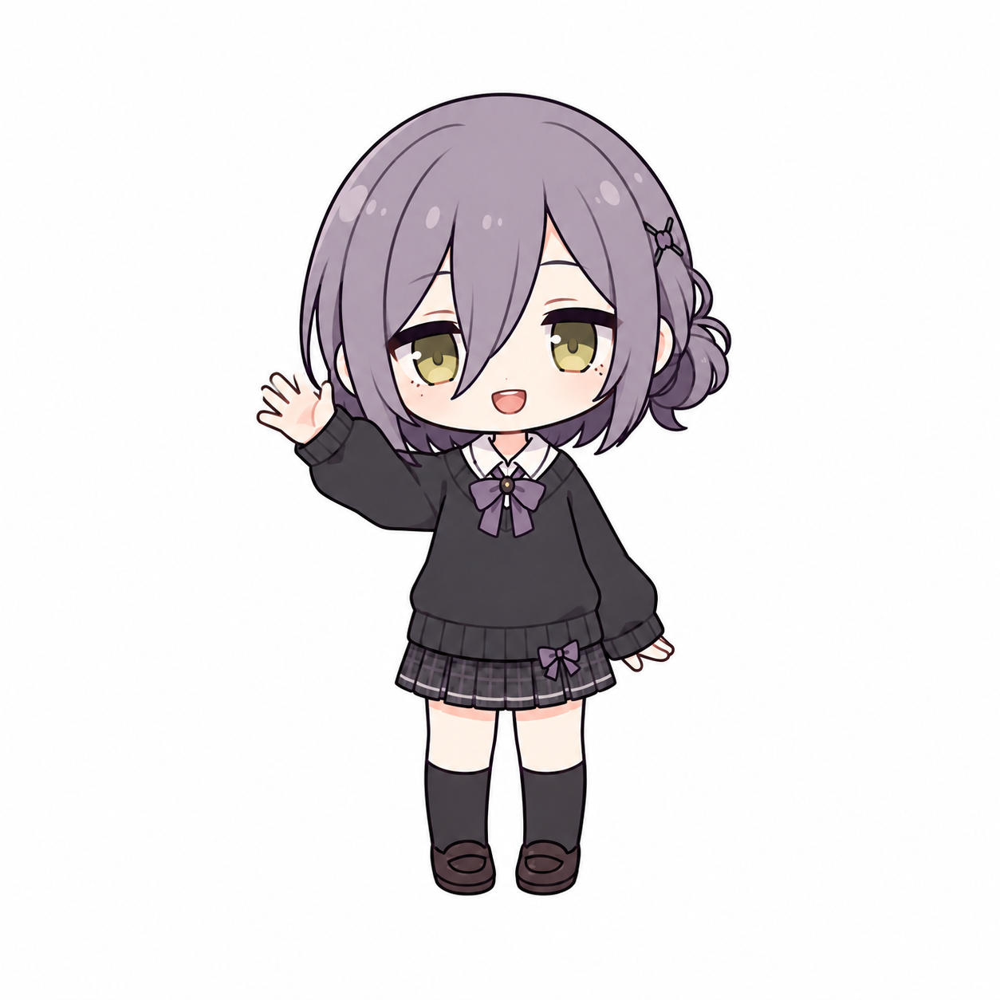
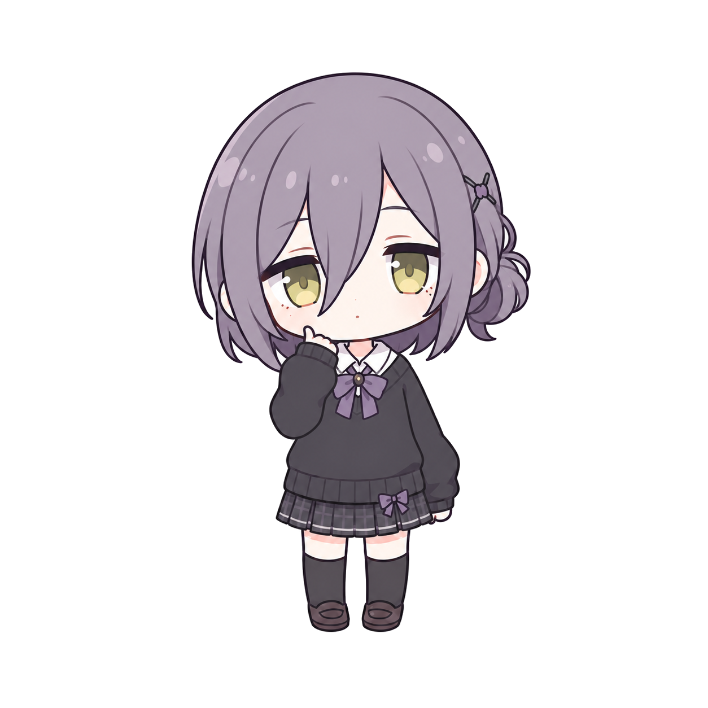
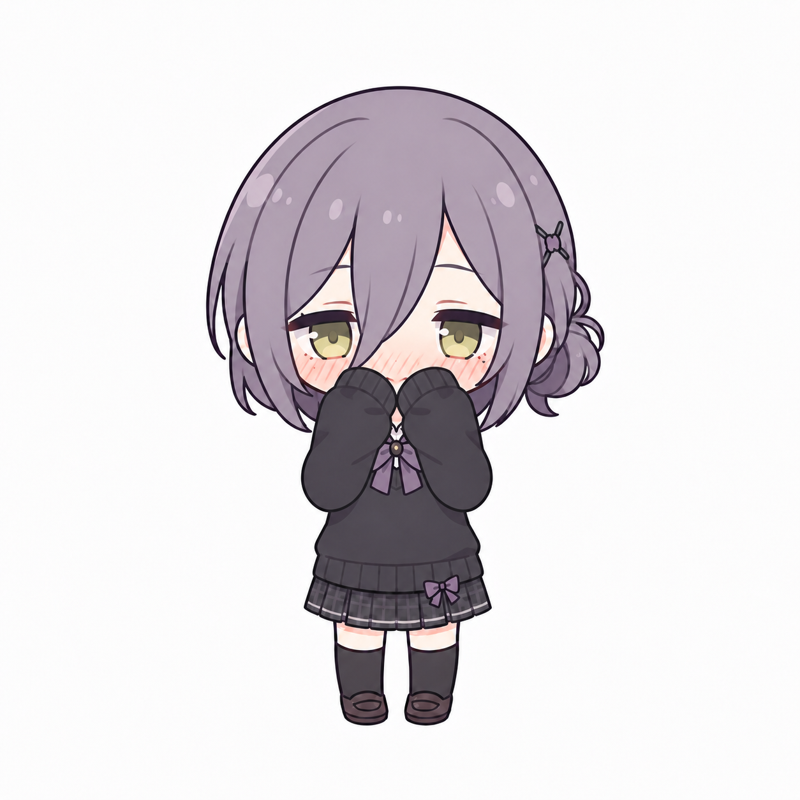
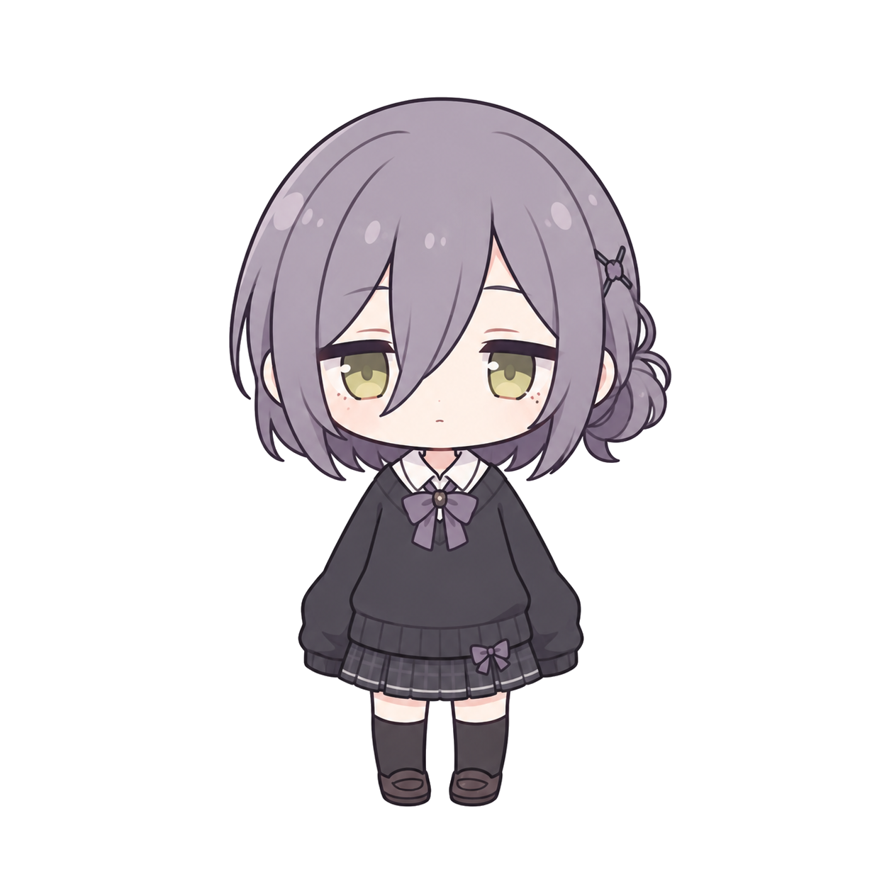
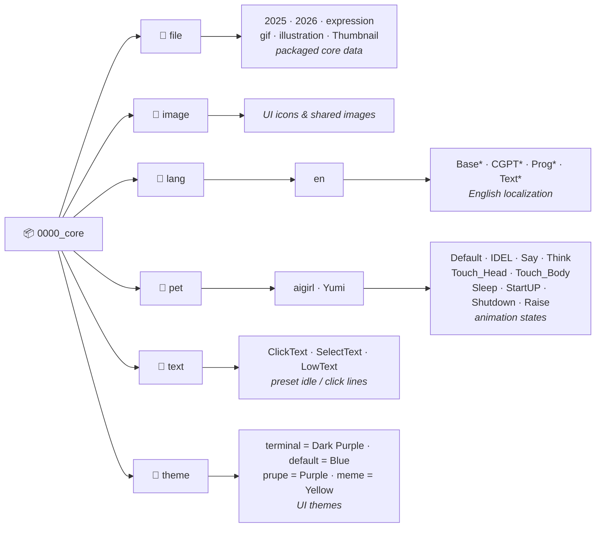

<div align="center">



# Yumi — Desktop Agent

**Your desktop isn't empty anymore. Yumi lives there.**

*An AI companion that talks, reacts, moves, and remembers — driven entirely by a large language model, running entirely on your machine.*


<p>
<a href="https://pump.fun/">
  
  
</a>
&nbsp;&nbsp;
<a href="https://x.com/">
  
</a>
</p>

</div>

---

## 🌌 What is Yumi?

Most "desktop pets" are puppets — a fixed set of canned animations on a timer. **Yumi is not a puppet.**

Yumi is a small animated character who lives on your desktop and is driven **end-to-end by a
large language model**. There is no dialogue tree, no scripted personality, no hard-coded
responses. When you talk to her, the model decides what to say, *how* to feel, which animation
to play, and whether something is worth remembering — all in real time, all on your machine.

She streams her replies token-by-token in a terminal-style chat bubble as she "thinks."
She triggers her own expressions through tool calls, so her face matches her words. She keeps
a long-term memory that survives restarts. And when the room goes quiet, she'll speak up on
her own. Point her at any Claude or OpenAI-compatible endpoint, paste your key, and she wakes up.

> **The pitch in one line:** it's not a mascot with a chatbot bolted on — it's an LLM given a
> body, a face, a memory, and a place to live.

---

## ✨ Meet Yumi

<div align="center">

<table>
<tr>
<td align="center"><br/><b>happy</b></td>
<td align="center"><br/><b>thinking</b></td>
<td align="center"><br/><b>working</b></td>
<td align="center"><br/><b>shy</b></td>
<td align="center"><br/><b>idle</b></td>
</tr>
</table>

*Every expression is chosen by the model, not a random timer.*

</div>

---

## ⚡ Why Yumi is different

| | Ordinary desktop pet | **Yumi** |
|---|---|---|
| Personality | Hard-coded lines | **Whatever the model is** — swap the persona, swap the vibe |
| Animations | Random / on a timer | **Chosen by the model** to fit the moment, via tool calls |
| Memory | None | **Persistent** long-term memory across sessions |
| Conversation | Keyword bot | **Real** streaming LLM chat, any Claude/OpenAI model |
| Initiative | Reactive only | **Proactive** — idle lines, reactions to events |
| Your data | Often phones home | **Nothing leaves your machine.** No account, no telemetry |

---

## 🧠 Features

- **🤖 LLM-driven, not scripted** — every reply, mood, and animation choice comes from the model at runtime. Change the model and Yumi genuinely changes.
- **🔌 Bring your own model** — native **Anthropic Messages API** *and* any **OpenAI-compatible** endpoint. Set base URL, key, and model name; that's it.
- **💬 Streaming speech** — replies render token-by-token in a terminal-style bubble, so she "types" as she thinks.
- **🎭 Tool-driven animation** — the model calls tools to play animations, keeping her expression in sync with what she's saying.
- **🧩 Long-term memory** — she remembers facts about you and recalls them in later sessions.
- **👀 Proactive & reactive** — idle lines when it's quiet, reactions to events — not just call-and-response.
- **📊 Usage panel** — a live readout of the active model, requests today, and input / output / total tokens.
- **🔒 Private by design** — everything runs locally. No cloud service, no account, no telemetry. Your key and chats stay on disk.
- **🎨 Themeable** — ships a **Dark Purple** terminal theme, plus **Blue / Purple / Yellow**.

---

## 🔧 How it works

```
You type  ─►  AIPet plugin builds the prompt (persona + memory + context)
          ─►  streams to your LLM (Anthropic / OpenAI-compatible)
          ─►  model streams back text  ──►  shown token-by-token in the bubble
          └─  model emits tool calls   ──►  play animation • save memory • react
                                        └─  loop until the turn is done
```

Yumi is a **host app** (the animated character, window, and rendering) plus a **brain plugin**
(`AIPet`) that owns the conversation, the tools, the memory, and the usage stats. The brain
talks to whatever model you point it at; the host gives it a body to express through.

---

## 🗂️ Architecture

```
VPet-Simulator.Core/               Rendering / animation / interaction core
VPet-Simulator.Windows/            Main application (settings, mod loader, saves)
VPet-Simulator.Windows.Interface/  Plugin contracts (chat box, base classes)
VPet.Plugin.AIPet/                 The brain: chat, tools, memory, usage stats
mod/0000_core/                     Core data: character, themes, language, text
tools/gen_pet.py                   Character animation-frame generator
```

**Core data layout (`mod/0000_core`):**



---

## 🚀 Build & run

Requires the **.NET 8 SDK**. The app is **x64-only**.

```powershell
# Build the app (x64 required)
dotnet build VPet-Simulator.Windows\VPet-Simulator.Windows.csproj -c Release -p:Platform=x64

# Build the AI plugin
dotnet build VPet.Plugin.AIPet\VPet.Plugin.AIPet.csproj -c Release
```

Assemble the run directory (output lands in `VPet-Simulator.Windows\bin\x64\Release\net8.0-windows`):

1. Copy `VPet-Simulator.Windows\mod` into the output `mod\` folder.
2. Copy the built plugin DLL into `mod\AIPet\plugin\`.
3. Run `VPet-Simulator.Windows.exe`.

---

## ⚙️ Configuration

Right-click Yumi → **System → Settings → chat API "AIDeskPet" → open settings**, then set:

- **Protocol** — Anthropic or OpenAI-compatible
- **API base URL**, **API key**, **model name**

Storage:
- AI config → the `AIPet` line of `Setting.lps`
- Chat history & token usage → `mod\AIPet\data\`

---

## 🗺️ Roadmap

**Phase 1 — Alive** ✅
Core LLM loop, streaming speech, tool-driven animation, long-term memory, usage panel, Yumi character, terminal theme.

**Phase 2 — Voice** 🔜
- 🔊 Voice output (EdgeTTS) — Yumi speaks out loud
- 🎙️ Voice input (Vosk) — talk to her hands-free

**Phase 3 — Reach** 🧭
- 🌐 Self-hosted backend for multiplayer / shared presence
- 🖥️ Screen & context awareness she can act on

**Phase 4 — Polish** 💅
- Restyle the remaining secondary windows to match the theme
- More characters and themes

---

## ❓ FAQ

**Does it send my data anywhere?**
No. Your API key and conversations stay on your machine. The only network call is the one *you*
configure — straight to your chosen LLM provider.

**Which models work?**
Any Anthropic Claude model (native Messages API) and any OpenAI-compatible endpoint.

**Can I change her personality?**
Yes — the persona is part of the prompt. Rewrite it and she becomes someone else.

**Windows only?**
For now, yes — it's a WPF / .NET 8 desktop app.

---

<div align="center">
<sub>Built on the VPet-Simulator engine (Apache-2.0).</sub>
</div>
